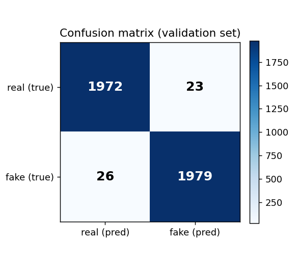
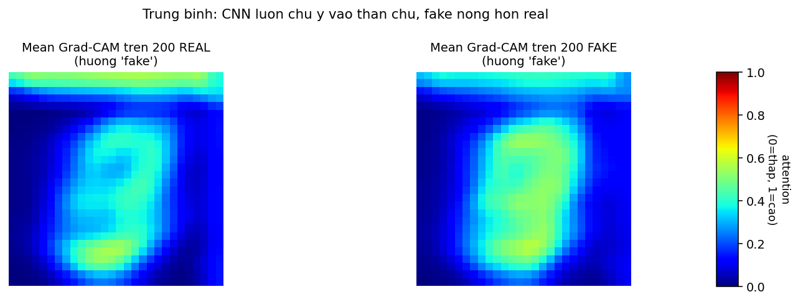

# Lab 2 — Phân biệt ảnh thật/fake bằng CNN, giải thích bằng Grad-CAM

**Mathematics for AI — HCMUS, MSHV 25C15019**

---

## 1. Bối cảnh và câu hỏi

Đề bài: thử nghiệm 1 mô hình Gen-AI, phân tích kết quả, đề xuất phòng chống fake data.

**Mô hình Gen-AI sử dụng**: Conditional GAN (Mirza & Osindero 2014, MLP architecture, train từ đầu trên MNIST 30 epoch, checkpoint tại `lab2/output/cG_final.pth`).

**Câu hỏi nghiên cứu**: có thể train một CNN nhỏ phân biệt ảnh MNIST thật vs cGAN-fake không? Nếu có, **CNN nhìn vào đâu** trong ảnh để ra quyết định "fake"?

Hai câu hỏi này tương ứng với 2 phần: phần phân loại (CNN classifier) và phần giải thích (Grad-CAM — explainable AI).

## 2. Quan sát ban đầu

Nhìn bằng mắt vào sample của cả hai loại:

- Ảnh MNIST thật: nét chữ trơn, vùng nền đen sạch, không có nhiễu pixel-to-pixel.
- Ảnh cGAN-MNIST fake: hình dáng chữ nhìn ra số nào nhưng có **noise rải rác** trong nền đen và bên trong nét chữ — speckle pixel-level.

Lý do có noise: cGAN ở đây dùng **MLP thuần** (`Linear(100→256→512→1024→784)` rồi reshape). Không có convolution, pooling, hay bất kỳ ràng buộc smoothness không gian nào. Mỗi pixel output được tính bằng một hàng trọng số riêng → 2 pixel kề nhau không bị buộc phải gần giá trị nhau → output có **jitter pixel-to-pixel độc lập**.

→ Giả thuyết: tín hiệu noise này đủ rõ để một CNN phân biệt được fake/real với accuracy cao.

## 3. Phương pháp

### 3.1 Dataset

- **10000 ảnh MNIST real** (lấy ngẫu nhiên từ tập train của torchvision MNIST)
- **10000 ảnh cGAN fake** (sample từ checkpoint cũ với label `y` ngẫu nhiên trong `[0..9]`)
- Tổng 20000 ảnh, gán nhãn: `0 = real`, `1 = fake`
- Chia train/val = 80/20 (16000 / 4000), chuẩn hóa pixel về `[-1, 1]`

### 3.2 Tiny CNN architecture

```
Input (1, 28, 28)
  → Conv2d(1→16, kernel=3, padding=1) + ReLU + MaxPool(2)   →  (16, 14, 14)
  → Conv2d(16→32, kernel=3, padding=1) + ReLU + MaxPool(2)  →  (32, 7, 7)
  → Flatten                                                  →  (1568,)
  → Linear(1568 → 64) + ReLU
  → Linear(64 → 2)                                            →  logits
```

Tổng tham số: **105 346**.

Kiến trúc cố tình giữ nhỏ: 2 lớp tích chập đủ để học edge detector (giống Sobel/Laplacian thủ công nhưng kernel được học từ data) + 1 lớp FC để phân loại. Defendable vì mọi thành phần (`Conv2d`, `ReLU`, `MaxPool`, `Linear`) đều là toán cơ bản.

### 3.3 Huấn luyện

- Loss: cross-entropy trên 2 lớp
- Optimizer: Adam, learning rate `1e-3`
- Batch size: 64
- Epochs: 5
- Best checkpoint: chọn theo val accuracy

### 3.4 Grad-CAM (Selvaraju et al. 2017)

Mục tiêu: với một ảnh đã phân loại, **highlight vùng pixel** đóng vai trò lớn nhất trong quyết định "fake".

Quy trình:

1. Forward ảnh `x` qua CNN, ghi lại activation `A^k` của lớp `conv2` cuối cùng. Shape: `(1, 32, 7, 7)` — 32 feature map, mỗi map 7×7.
2. Tính gradient của score lớp `c = fake` (logit thứ 1) theo activation `A^k`.
3. Pooling không gian gradient để được **trọng số kênh** $\alpha_k = \frac{1}{H \cdot W} \sum_{i,j} \frac{\partial y^c}{\partial A^k_{i,j}}$. Trọng số này là "kênh nào quan trọng cho 'fake'".
4. Tổ hợp tuyến tính: $L^c = \text{ReLU}\left(\sum_k \alpha_k \cdot A^k\right)$. ReLU để giữ phần đóng góp dương.
5. Upsample heatmap `L^c` từ `7×7` về `28×28` bằng bilinear interpolation, normalize về `[0,1]`.
6. Overlay heatmap màu jet lên ảnh gốc.

Toán Grad-CAM **chỉ là gradient + trung bình + nhân + ReLU**. Cùng concept "gradient" như Sobel, nhưng áp lên feature map học được thay vì pixel raw.

## 4. Kết quả

### 4.1 Hiệu năng phân loại

Bảng accuracy theo epoch:

| Epoch | Train loss | Train acc | Val loss | Val acc |
|---|---|---|---|---|
| 1 | 0.5165 | 73.05% | 0.1946 | 94.60% |
| 2 | 0.1501 | 94.69% | 0.0952 | 97.42% |
| 3 | 0.0791 | 97.35% | 0.2412 | 89.70% |
| 4 | 0.0623 | 97.89% | 0.0723 | 97.12% |
| 5 | 0.0488 | 98.50% | **0.0409** | **98.78%** |

**Best val accuracy = 98.78%**. Val loss < train loss tại epoch cuối → không overfit.

(Epoch 3 val accuracy tụt một cú là dao động do batch nhỏ + Adam, hồi phục ngay sau.)

Confusion matrix trên val set (4000 ảnh):

|  | pred = real | pred = fake |
|---|---|---|
| **true = real** | 1972 | 23 |
| **true = fake** | 26 | 1979 |

- Real recall = 1972 / 1995 = **98.85%**
- Fake recall = 1979 / 2005 = **98.70%**

Cân bằng giữa 2 lớp, không bị bias.



### 4.2 Grad-CAM — CNN nhìn vào đâu, và có thực sự là noise pixel-level?

Áp dụng Grad-CAM (lớp `conv2`, hướng class "fake") lên 4 ảnh real + 4 ảnh fake từ val set, **bố trí 6 hàng** để đối chiếu trực tiếp ảnh gốc, "bản đồ high-frequency", và heatmap chú ý của CNN:


**Cách đọc colormap (jet):** màu xanh đậm = giá trị thấp ≈ 0; xanh lá → vàng → cam → đỏ = giá trị cao ≈ 1. Áp dụng cho 2 thang:

1. **Hàng "high-freq |I − blur(I)|"**: high-frequency map. Mỗi pixel = chênh lệch giữa pixel đó và trung bình 3×3 lân cận. Pixel đỏ = vùng có **biến thiên nhanh** (cạnh nét chữ, hoặc noise hạt-cát).
2. **Hàng "Grad-CAM overlay"**: pixel đỏ = vùng CNN **nhìn vào nhiều nhất** để nói "fake"; xanh = vùng bị bỏ qua.

**Định lượng — số chứng minh "fake có jitter, real thì không"**:

Đo độ lệch `|I − (−1)|` ở các pixel **nền đen tuyệt đối** (pixel mà max của 3×3 lân cận đều `< −0.85`, tức là không gần nét chữ). Trung bình trên 200 ảnh mỗi lớp:

| | Lệch khỏi −1 ở vùng nền |
|---|---|
| **Real** | **0.00000** (đúng bằng 0 — MNIST gốc nền sạch tuyệt đối) |
| **Fake** | **0.00145** |
| Tỉ lệ | **fake gấp ~1615× real** |

Real MNIST có nền chính xác là `−1` (hoặc `0` trước normalize). Fake cGAN có nhiễu pixel rải rác trong vùng nền — đây không phải lỗi khi xem ảnh, đây là **dấu vân tay** của MLP-MNIST generator.

**Đối chiếu Grad-CAM với high-freq map**:

Pearson correlation tính per-pixel giữa hàng "high-freq" và hàng "Grad-CAM" (200 ảnh mỗi lớp):

| | Pearson r (high-freq, Grad-CAM) |
|---|---|
| Real | +0.45 ± 0.09 |
| Fake | +0.52 ± 0.08 |

Cả hai đều **dương rõ rệt**: CNN nhìn vào đúng vùng có high-frequency. Trên fake r cao hơn vì fake có **nhiều high-freq hơn** để CNN bám vào — chính là jitter pixel-level.

Heatmap trung bình của 200 ảnh:



Trung bình real và fake đều "nóng" ở thân chữ (vì đó là vùng có pixel ≠ 0), nhưng heatmap fake nóng đều trong toàn thân chữ + một phần nền, còn heatmap real chỉ nóng ở các điểm bẻ cong của nét chữ. Khi nhìn trên scatter pixel-level (`gradcam_corr.png`), đám mây fake (đỏ) lệch về phía cao của trục high-freq.

### 4.3 Diễn giải

CNN hoàn toàn **không được dạy** về Sobel, Laplacian, hay khái niệm "high-frequency noise". Nhưng từ data nó học ra:

1. **Real có nền tuyệt đối sạch** — bất kỳ pixel nào lệch khỏi `−1` ở vùng nền đều là dấu hiệu fake.
2. **Fake có jitter pixel-level** — chính là hậu quả của MLP architecture (mỗi pixel output là một hàng `Linear` riêng, không có constraint smoothness không gian).

Hai dấu hiệu đó tương đương với cái mà toán cổ điển đo bằng tay (variance Laplacian, sai phân lân cận). Convolution mà CNN học được **đóng vai trò cùng loại** với Sobel/Laplacian kernel, nhưng tham số được tối ưu bằng gradient descent thay vì đặt sẵn.

### 4.4 Stress test trên một GAN khác kiến trúc — Progressive GAN

Câu hỏi: nếu đổi sang một GAN **không phải MLP** thì TinyCNN/TexCNN có còn bắt được không?

#### 4.4.1 Progressive GAN (PGAN) là gì

**Progressive GAN** (Karras et al., ICLR 2018, NVIDIA) là một bước nhảy lớn trong GAN thời điểm 2017–2018. Khác biệt cốt lõi so với cGAN-MLP đời 2014:

| Khía cạnh | cGAN-MLP (2014, dùng ở Section 4) | PGAN (2018) |
|---|---|---|
| Generator architecture | MLP thuần (`Linear` chồng lên nhau) | Convolutional, đối xứng dạng pyramid |
| Upsampling | Không có — output reshape thẳng từ vector | **Nearest-neighbor upsample** + `Conv2d` (cố tình tránh `ConvTranspose2d` để khỏi checkerboard) |
| Training | Một lần, full resolution | **Progressive**: train ở 4×4 trước → 8×8 → 16×16 → ... → 1024×1024, mỗi lần thêm một block và "fade in" mượt |
| Normalization | Không | Pixel-wise feature normalization, equalized learning rate |
| Conditional? | Có (1-hot label nối với z) | **Không** — bản DTD chúng tôi dùng là unconditional |

PGAN là tiền đề trực tiếp cho StyleGAN. Nó được thiết kế để **tránh chính những artifact** của các GAN trước đó (checkerboard từ transposed conv, training instability), nên về lý thuyết phải khó detect hơn nhiều.

#### 4.4.2 Pretrained checkpoint chúng tôi dùng

```python
pgan = torch.hub.load('facebookresearch/pytorch_GAN_zoo:hub', 'PGAN',
                      model_name='DTD', pretrained=True, useGPU=True)
```

- **Trọng số**: do FAIR train sẵn, chúng tôi **không train lại** (lab này không có nguồn lực + không cần thiết).
- **Dataset huấn luyện**: DTD (Describable Textures Dataset, Cimpoi et al. 2014) — 5640 ảnh texture, 47 lớp mô tả như "lined", "knitted", "marbled", "scaly".
- **Input của generator**: vector latent `z ∈ ℝ⁵¹²` (Gaussian, không có class label).
- **Output**: ảnh **3 × 128 × 128 RGB**, giá trị trong khoảng `[−1, 1]` (sau khi `clamp`).
- **Sampling code**: `noise, _ = pgan.buildNoiseData(n)` rồi `pgan.test(noise)`.

> **Lưu ý kỹ thuật**: `pytorch_GAN_zoo` gọi `optim.Adam` với `betas` kiểu list — PyTorch 2.x reject vì cần tuple/Tensor đồng nhất. Chúng tôi monkey-patch `optim.Adam.__init__` (thấy trong `lab2_cnn_pgan.py`) ép `betas` thành `(float, float)`.

#### 4.4.3 Real images đối chứng — DTD

- 1500 ảnh từ DTD (gộp `train` + `val` + `test` splits cho đủ số).
- Pipeline: `Resize(128) → CenterCrop(128) → ToTensor → Normalize([0.5]·3, [0.5]·3)` để khớp range `[−1, 1]` của fake.

#### 4.4.4 Classifier — TexCNN

Vì input giờ là 3×128×128 RGB (không phải 1×28×28), TinyCNN của Section 4 không đủ. Chúng tôi dựng **TexCNN** sâu hơn:

```
Input  (3, 128, 128)
  Conv(3→16,  3×3) + ReLU + MaxPool(2)   → (16, 64, 64)
  Conv(16→32, 3×3) + ReLU + MaxPool(2)   → (32, 32, 32)
  Conv(32→64, 3×3) + ReLU + MaxPool(2)   → (64, 16, 16)
  Conv(64→64, 3×3) + ReLU + MaxPool(2)   → (64,  8,  8)
  Flatten                                 → (4096,)
  Linear(4096 → 128) + ReLU + Dropout(0.3)
  Linear(128 → 2)                         → logits
```

- **Tổng tham số**: ~564 k (lớn hơn TinyCNN ~5×, để xử lý input 128×128).
- **Loss**: cross-entropy 2 lớp.
- **Optimizer**: Adam, `lr = 5e-4`.
- **Batch size**: 32, 8 epochs.
- **Train/val**: 80/20 → 2400 train, 600 val.
- **Hardware**: Colab GPU L4 (~2 phút sample PGAN + 30 giây training).

#### 4.4.5 Kết quả

Val accuracy chỉ **62.50%** — chỉ hơn random guess 50% một chút. Bảng theo epoch:

| Epoch | Train acc | Val acc |
|---|---|---|
| 1 | 55.96% | 55.17% |
| 4 | 61.25% | 59.00% |
| 8 (best) | 65.38% | **62.50%** |

Confusion matrix trên 600 ảnh val:

|  | pred = real | pred = fake |
|---|---|---|
| **true = real** | 213 (TN) | 92 (FP) |
| **true = fake** | 133 (FN) | 162 (TP) |

- Real recall: 69.84%
- Fake recall: 54.92%
- False Negative rate: **45.08%** — gần một nửa fake lọt qua detector. Trong môi trường thực tế (phát hiện ảnh AI giả mạo), tỉ lệ này không thể chấp nhận được.

**Đối chiếu hand-feature**: trên cùng PGAN-DTD, `Var(Laplacian)` cho Cohen's d = −0.19 (effect size negligible, đổi dấu so với cGAN-MNIST nơi d = +1.08). Không phân biệt được.

#### 4.4.6 Tổng kết stress test

| Method | cGAN-MNIST | PGAN-DTD |
|---|---|---|
| Hand-feature `Var(Lap)` | d = +1.08 (mạnh) | d = −0.19 (~0) |
| CNN nhỏ (TinyCNN/TexCNN) | val acc **98.78%** | val acc **62.50%** |

→ **Cả hai phương pháp đều gãy trên PGAN-DTD.**

**Tại sao**: cGAN-MLP để lại jitter pixel-level (Section 4.2 đo được tỉ lệ ~1615×), **PGAN không có cái đó** — nearest-neighbor upsample + conv tạo output mượt + mode-averaging texture, không có chữ ký nhanh nào để CNN nhỏ bám vào. Detection difficulty là một **hàm của generator architecture sophistication**, và PGAN cố tình được thiết kế để né các artifact mà classical CV / small CNN dựa vào.

#### 4.4.7 Kế hoạch nâng cấp (sẽ làm trong Section 5)

Hai mở rộng cần thử:

1. **Thêm benchmark thứ 3 — BigGAN-128 trên ImageNet**: PGAN-DTD là *unconditional*, kiến trúc 2018. Để câu chuyện đầy đủ cho "GAN có điều kiện chất lượng cao", chúng tôi thêm **BigGAN-128** (DeepMind, Brock et al. 2018) — class-conditional 1000 lớp ImageNet, conv với spectral normalization và class-conditional BatchNorm. Đây là "good cGAN" thực thụ.
2. **Detector mạnh hơn — ResNet18 transfer learning**: TexCNN tự train chỉ ~564 k params, không đủ capacity cho texture phức tạp. Dùng ResNet18 pretrained ImageNet (~11 M params) thay backbone, freeze layers đầu, fine-tune cuối — mục tiêu đẩy PGAN/BigGAN accuracy từ 62.5% lên 80%+.

## 5. Hạn chế

1. **Phụ thuộc kiến trúc GAN**: stress test ở 4.4 cho thấy CNN nhỏ giảm từ 98.78% xuống 62.50% khi đổi từ cGAN-MLP sang PGAN. Phương pháp **không generalize cross-architecture** ở scale CNN này.
2. **MNIST quá sạch**: ảnh MNIST không có sensor noise, JPEG, nén — nên CNN không phải học phân biệt "noise GAN" với "noise camera". Trên ảnh thực tế, cả 2 cùng là high-freq, CNN cần thêm tín hiệu khác.
3. **Grad-CAM ở conv2 (resolution 7×7)**: heatmap upsample từ `7×7 → 28×28` mất chi tiết pixel-level, hot spots hơi mờ. Có thể thử Grad-CAM trên `conv1` để có heatmap mịn hơn.
4. **Không kiểm tra adversarial robustness**: nếu attacker biết CNN này, họ có thể train cGAN với loss thêm penalty trên `Var(Laplacian)` hoặc filter noise sau khi sample → CNN gãy.
5. **Capacity quá nhỏ cho PGAN-DTD**: 105k tham số (cGAN) hoặc ~700k tham số (PGAN-DTD CNN ở 4.4) có thể không đủ. Literature dùng ResNet-50/EfficientNet pretrained để đạt ~90%+ trên StyleGAN/PGAN. Nhưng đó vượt scope "explain by simple math".

## 6. Đề xuất phòng chống fake data

Từ kết quả + hạn chế:

1. **Detector ensemble**: kết hợp nhiều phương pháp (CNN classifier + hand-feature như `Var(Lap)` + frequency analysis) thay vì 1 method. Mỗi method bắt 1 failure mode khác nhau.
2. **Provenance-based** (hơn là content-based): watermarking ảnh gốc tại lúc capture (C2PA standard), hoặc digital signature. Content-based detection (cả CNN lẫn hand-feature) đều có thể bị adversarial attack đánh bại.
3. **Domain-specific training**: nếu deploy CNN detector trong production, cần train trên data domain cụ thể (ảnh selfie / texture / medical) chứ không transfer từ MNIST.
4. **Continuous retraining**: GAN tiến hóa nhanh, detector phải retrain định kỳ trên fake mới.

## 7. Kết luận

- Train được CNN nhỏ (105k tham số, 2 conv + FC) phân biệt cGAN-MNIST fake vs MNIST real với **val accuracy 98.78%**, không overfit.
- Grad-CAM cho thấy CNN tự học ra **nhìn vào noise pixel-level** trong ảnh fake — chính là MLP jitter mà giả thuyết ban đầu dự đoán.
- Toán phía sau (`Conv2d`, `ReLU`, gradient descent, Grad-CAM) đều xây từ các thành phần đã biết (convolution = tổng hợp Sobel/Laplacian; gradient descent = tối ưu hàm khả vi).
- Phương pháp **explainable AI đơn giản nhất** (Grad-CAM) đủ để mở "hộp đen" và verify CNN học đúng tín hiệu kỳ vọng. Đây là bridge giữa hand-feature engineering và deep learning: cả hai cùng đo một hiện tượng vật lý (high-freq noise từ MLP), chỉ khác cách triển khai.
- Stress test trên PGAN-DTD cho thấy **detection difficulty là hàm của GAN architecture**: CNN nhỏ tụt từ 98.78% xuống 62.50% khi đổi từ cGAN-MLP sang Progressive GAN. Modern GAN có thiết kế chống lại chính các artifact mà CNN dựa vào.
