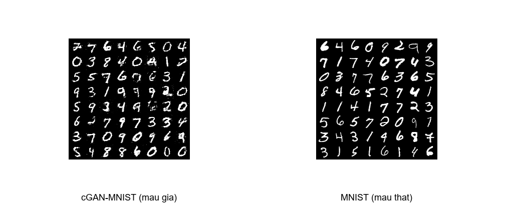
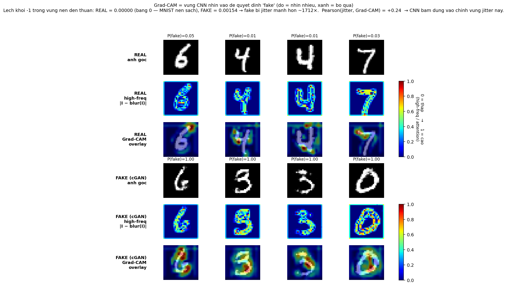
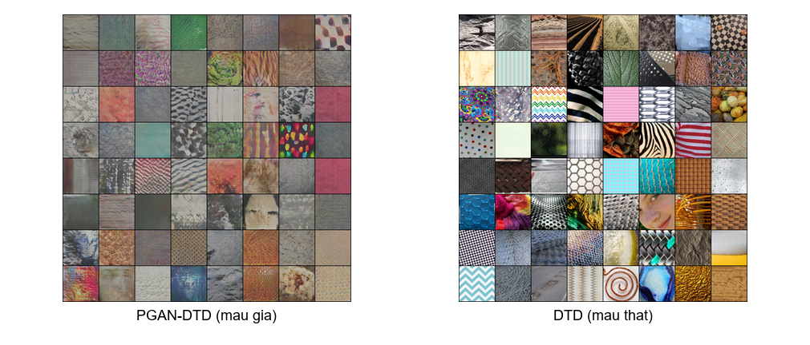

# Lab 02. Phát hiện ảnh GAN giả mạo bằng CNN và Grad-CAM

**Môn**: Toán cho Trí tuệ nhân tạo
**HV**: Nguyễn Minh Nhựt, MSHV 25C15019
**Repo**: <https://github.com/nmnhut-it/math-for-ai> (folder `lab2_cnn/`)

## 1. Đề bài

Bài thực hành yêu cầu thử một mô hình Gen-AI, phân tích kết quả, và đề xuất phòng chống dữ liệu giả. Ảnh do GAN sinh ra ngày nay đủ chân thực để qua được mắt thường, gây rủi ro cho việc xác minh thông tin trên mạng. Câu hỏi đặt ra: liệu có thể tự động phân biệt được ảnh do GAN sinh ra với ảnh thật hay không, và phương pháp đó có tổng quát hoá được sang các kiến trúc GAN khác nhau không.

Bài này dùng GAN, không dùng Diffusion. Toàn bộ chạy trên Colab GPU L4. Notebook `colab_pgan.ipynb` chạy lại được trong một lần.

## 2. Khởi đầu: huấn luyện một cGAN trên MNIST

Một GAN gồm hai mạng huấn luyện đối kháng nhau. Bộ sinh G (generator) nhận vector ngẫu nhiên `z` và sinh ra ảnh, bộ phân biệt D (discriminator) xem ảnh rồi đoán thật hay giả. Hai bên thay phiên cập nhật trọng số, G cố qua mặt D còn D cố không bị qua mặt. Khi cân bằng, phân phối ảnh do G sinh ra đã đủ gần với phân phối ảnh thật trong tập huấn luyện.

Conditional GAN (cGAN, Mirza và Osindero 2014) thêm vào một điều kiện, ở đây là nhãn lớp số 0 đến 9, để có thể yêu cầu G sinh ra ảnh số nào tuỳ ý. Kiến trúc dùng trong bài là MLP thuần. G nhận `z ∈ ℝ¹⁰⁰` ghép với one-hot nhãn lớp, đi qua chuỗi `Linear(110→256→512→1024→784)`, rồi reshape thành 28×28. D đối xứng. Huấn luyện trên 60 000 ảnh MNIST, 30 chu kỳ, Adam `lr=2e-4`. Phần huấn luyện này thuộc Lab 2 phần FFT trước đó, bài này dùng lại checkpoint `cG_final.pth`.



Sau huấn luyện, cGAN sinh ra chữ số nhận ra được, nét chữ đôi khi không liền và độ đậm không đều. Điểm khác biệt rõ nhất so với MNIST thật nằm ở vùng nền, lẽ ra phải đen tuyệt đối thì lại có nhiễu lấm tấm. Latent walk đi liên tục theo `z` cho thấy mô hình không bị hỏng và thật sự sinh được ảnh đa dạng, nên nhiễu nền không phải do huấn luyện chưa đủ mà là dấu vết bản thân kiến trúc MLP để lại.

## 3. Phát hiện cGAN này bằng một CNN nhỏ

Câu hỏi đặt ra: nếu nhiễu nền là dấu vết kiến trúc, liệu một CNN nhỏ huấn luyện đầu cuối có học ra được tín hiệu đó không, mà không cần ai chỉ cho biết phải nhìn vào đâu.

Lấy 10 000 ảnh MNIST thật và 10 000 ảnh do cGAN sinh ra (nhãn lớp ngẫu nhiên), gán nhãn 0 cho thật, 1 cho giả, rồi huấn luyện một CNN nhỏ gọi là TinyCNN gồm hai tầng tích chập và một tầng kết nối đầy đủ:

```
Đầu vào (1, 28, 28)
  Conv2d(1→16, 3×3) + ReLU + MaxPool(2)   → (16, 14, 14)
  Conv2d(16→32, 3×3) + ReLU + MaxPool(2)  → (32, 7, 7)
  Flatten → Linear(1568 → 64) + ReLU → Linear(64 → 2)
```

Tổng 105 346 tham số. Adam `lr=1e-3`, lô 64, 5 chu kỳ. Kết quả ở chu kỳ tốt nhất: độ chính xác trên tập kiểm tra **98.00 %**, độ phủ thật 96.19 %, độ phủ giả 99.80 %. Trong 4000 mẫu kiểm tra, ma trận nhầm lẫn 1919/76 (thật/đoán giả) và 4/2001 (giả/đoán giả).

Để biết TinyCNN dựa vào đâu, áp Grad-CAM (Selvaraju và cộng sự 2017) tại tầng `conv2`. Với activation $A^k$ và class score $y^c$, trọng số kênh là gradient gộp toàn cục $\alpha_k = \frac{1}{HW}\sum_{i,j} \partial y^c/\partial A^k_{i,j}$, heatmap là $L^c = \mathrm{ReLU}(\sum_k \alpha_k A^k)$. Upsample heatmap từ 7×7 lên 28×28 rồi overlay lên ảnh. Heatmap có giá trị cao ở những vùng ảnh nào đẩy mạnh class score, tức là vùng CNN xem là quan trọng cho quyết định.



Hàng `|I − blur(I)|` (tần số cao) cho thấy ảnh thật chỉ có high-frequency ở mép nét chữ, còn ảnh giả thì có ở cả thân chữ lẫn rải rác trong nền. Hàng `Grad-CAM overlay` ở phía giả bám đúng vào những vùng nhiễu đó. CNN tự học ra việc nhìn vào nhiễu nền mà không cần ai mớm.

Vì sao kiến trúc cGAN-MLP để lại nhiễu nền thế này? MLP của G không có cơ chế chia sẻ trọng số theo không gian như convolution, nên không có ràng buộc nào ép hai pixel kề nhau phải gần giá trị nhau. Mỗi pixel output 28×28 là một hàm phi tuyến độc lập của toàn bộ vector `z`, đi qua nhiều tầng `Linear` cộng phi tuyến. Khi G cố sinh ra một chữ số có nền tối, không có gì đảm bảo mọi pixel nền cùng đạt đúng `−1` cùng lúc nên xuất hiện nhiễu. Đây là dấu vết trực tiếp của việc thiếu thiên kiến không gian (spatial inductive bias) trong kiến trúc, và TinyCNN học ra đúng dấu vết đó.

Như vậy với cGAN, một CNN nhỏ huấn luyện đầu cuối trên cặp thật-giả là đủ bắt được dấu vết cục bộ. Liệu cách làm này còn dùng được khi đổi sang một GAN hiện đại hơn không.

## 4. Liệu phương pháp này có tổng quát hoá: thử trên PGAN

cGAN-MLP là kiến trúc cũ và đơn giản. Các GAN hiện đại đã chuyển sang bộ sinh dạng tích chập, có thể đã loại được nhiễu pixel kiểu trên. Vậy nếu thay bằng một GAN tích chập và đổi sang một tập dữ liệu khác hẳn (kết cấu thay vì chữ số), liệu một CNN nhỏ tương tự còn phát hiện được không.

Bài chuyển sang Progressive GAN (PGAN, Karras và cộng sự 2018). Kiến trúc này khác cGAN-MLP ở vài điểm chính. Bộ sinh dùng tích chập thay vì MLP. Huấn luyện tăng dần độ phân giải từ 4×4 lên dần đến 1024×1024, mỗi giai đoạn ổn định trước khi mở tầng mới. Upsample bằng nearest-neighbor kèm `Conv2d` thay vì tích chập chuyển vị (transposed convolution), nhờ đó tránh được vân ô bàn cờ (checkerboard artifact). Bản dùng trong bài đã được FAIR (Facebook AI Research) huấn luyện sẵn trên DTD (Describable Textures, 5640 ảnh, 47 lớp kết cấu), latent `z ∈ ℝ⁵¹²`, đầu ra 3×128×128 RGB, không có nhãn lớp.



Bộ dữ liệu gồm 1500 mẫu giả từ PGAN và 1500 mẫu thật từ DTD (resize-crop 128×128). Bộ phát hiện thiết kế cho kích thước ảnh này gọi là TexCNN, gồm bốn tầng tích chập và một tầng kết nối đầy đủ:

```
Conv(3→16) → Conv(16→32) → Conv(32→64) → Conv(64→64), mỗi conv 3×3 + pool
Flatten → Linear(4096 → 128) + Dropout(0.3) → Linear(128 → 2)
```

Tổng 585 186 tham số. Adam `lr=5e-4`, lô 32, 8 chu kỳ. Độ chính xác tốt nhất chỉ **61.67 %**, hơn đoán ngẫu nhiên chừng 12 điểm. Độ phủ thật 65.57 %, độ phủ giả 57.63 %. Trong 600 mẫu kiểm tra: 200/105 và 125/170, gần một nửa ảnh giả lọt qua. Sau 8 chu kỳ, train accuracy mới đạt 65.58 % và val đã đứng yên ở 61.67 % từ chu kỳ 7 (xem `colab_result/results_pgan.txt`), khoảng cách train-val nhỏ. Đây là tình trạng underfitting do năng lực mô hình hoặc dữ liệu chứ không phải do thiếu chu kỳ huấn luyện.

Có thể hiểu kết quả này theo hai hướng đối lập. Một là chính PGAN khó phát hiện vì sinh ảnh quá mượt, không để lại nhiễu pixel rõ rệt như cGAN. Hai là TexCNN huấn luyện từ đầu trên 5000 ảnh chưa đủ mạnh để bắt dấu vết. Hai cách hiểu này dẫn đến hai kết luận khác nhau hoàn toàn, nên phải có đối chứng mới tách được.

## 5. Đối chứng: học chuyển giao ResNet18 trên cùng dataset

Phương pháp đối chứng tự nhiên là giữ nguyên dataset PGAN-DTD, đổi bộ phát hiện từ TexCNN huấn luyện từ đầu sang một bộ phát hiện mạnh hơn. Nếu bộ phát hiện mới đẩy độ chính xác lên cao, kết luận là TexCNN yếu chứ không phải PGAN khó.

Cụ thể bài chọn ResNet18 đã được huấn luyện sẵn trên ImageNet. ImageNet có 1.2 triệu ảnh tự nhiên thuộc 1000 lớp, và ResNet18 được tối ưu để phân loại 1000 lớp đó. Trong quá trình huấn luyện, các tầng tích chập buộc phải mã hoá được những thống kê thị giác của ảnh tự nhiên: cạnh, kết cấu, mảnh đối tượng, hình dạng tổng thể. Sau khi huấn luyện xong, tầng `avgpool` cho ra một vector 512 chiều cho mỗi ảnh, có thể xem là một biểu diễn của ảnh trong không gian đặc trưng mà ResNet đã học. Vector của một ảnh tự nhiên thật nằm gần đa tạp (manifold) các vector mà ResNet đã thấy 1.2 triệu lần. Vector của một ảnh do GAN sinh ra, dù pixel trông hợp lý, vẫn không khớp đa tạp đó, vì GAN chỉ được huấn luyện để qua mặt bộ phân biệt riêng của nó chứ không phải để khớp đặc trưng của ResNet. Vì vậy, một siêu phẳng `Linear(512→2)` đủ để tách hai loại.

Học chuyển giao chia hai pha. Pha 1 frozen (giữ nguyên trọng số) toàn bộ bộ trích đặc trưng từ `conv1` đến `layer3`, thay tầng phân loại cuối `fc` thành `Linear(512→2)`, chỉ huấn luyện riêng tầng này (1026 tham số học được; 3 chu kỳ; Adam `lr=1e-3`). Sau đó pha 2 mở khoá `layer4` cùng `fc` để tinh chỉnh sâu hơn (8 394 754 tham số học được; 12 chu kỳ; Adam `lr=1e-4`). Tập dữ liệu tăng lên 2500 mẫu mỗi lớp, chia 80/20 train/val theo seed cố định 42 (xem `lab2_cnn_pgan_resnet.py`). Mẫu giả được sinh từ noise seed riêng nên không trùng z-vector giữa hai pha.

Pha 1 đạt 88.70 % chỉ với 1026 tham số học được. Một siêu phẳng huấn luyện trên đặc trưng ImageNet frozen đã tách được PGAN-fake khỏi DTD-real, ResNet không cần biết gì về GAN, không cần chạm vào bộ trích đặc trưng. Đây là chứng cứ gián tiếp cho lập luận đa tạp ở trên. Cách đo trực tiếp là tính khoảng cách giữa vector real và fake trong không gian 512 chiều (cosine hay MMD chẳng hạn), bài này chưa làm. Pha 2 tinh chỉnh đẩy lên **98.70 %** (độ phủ thật 97.92 %, độ phủ giả 99.42 %; trong 1000 mẫu kiểm tra, 471/10 và 3/516).

Câu trả lời cho hai khả năng ở Mục 4: TexCNN huấn luyện từ đầu yếu chứ không phải PGAN khó. Phương pháp huấn luyện đầu cuối tổng quát hoá được, với điều kiện bộ phát hiện có tiền-huấn-luyện trên ảnh tự nhiên.

Để loại trừ trường hợp PGAN tình cờ dễ với ResNet còn các GAN khác thì khó, áp dụng cùng quy trình lên BigGAN-128 (Brock và cộng sự 2018, DeepMind). BigGAN khác PGAN ở chỗ có điều kiện theo lớp (class-conditional), có nhãn lớp giống cGAN ở Mục 2 nhưng trên 1000 lớp ImageNet thay vì 10 lớp số, và dùng chuẩn hoá phổ (spectral normalization) để ổn định huấn luyện ở quy mô lớn. Lấy 2500 mẫu giả qua `pytorch-pretrained-biggan` với ngưỡng cắt truncation 0.4 và mã lớp ngẫu nhiên. Mẫu thật lấy 2500 ảnh từ Imagenette-160, một tập con 10 lớp ImageNet công khai.


Cùng quy trình ResNet18 học chuyển giao. Pha 1 đạt 90.30 %, pha 2 đạt **99.10 %** (độ phủ thật 98.54 %, độ phủ giả 99.61 %; 474/7 và 2/517). Chênh PGAN 0.4 điểm, gần như bằng nhau.

## 6. Một bộ phát hiện có dùng được cho GAN khác không, hay mỗi GAN có vân tay riêng

Cho đến đây cả ba thí nghiệm đều giả định một điều. Người làm phải biết GAN đã huấn luyện trên tập dữ liệu nào và truy cập được tập dữ liệu đó để lấy ảnh thật ghép cặp với ảnh giả. Đây là tình huống hộp trắng (white-box). Trong tình huống thực tế ảnh đến không kèm siêu dữ liệu (metadata) và không biết nguồn gốc thì giả định này không còn. Vậy nếu lấy bộ phát hiện đã huấn luyện trên một cặp (GAN, tập dữ liệu) đem áp lên cặp khác thì sao?

Bài thử nghiệm như sau. Lấy ResNet18 đã huấn luyện trên (Imagenette real, BigGAN fake) ở Mục 5, không động vào trọng số, đem áp trực tiếp lên 500 ảnh DTD thật cộng 500 ảnh PGAN-DTD giả vừa sinh lại trên máy. Độ chính xác đạt **51.20 %**, gần ngẫu nhiên 50 %. Độ phủ thật 42.0 %, độ phủ giả 60.4 %. Trong 1000 mẫu kiểm tra, ma trận nhầm lẫn 210/290 (DTD thật / đoán giả) và 198/302 (PGAN giả / đoán giả).

Bộ phát hiện chia hơn nửa ảnh DTD thật vào nhóm giả. Có thể giải thích thế này. Ở Mục 5, bộ phát hiện học phân biệt ảnh ImageNet (có vật thể chính) với ảnh BigGAN sinh theo kiểu ImageNet, cả hai đều là ảnh đời thường có chủ thể rõ. Khi đem áp lên DTD vốn là ảnh kết cấu thuần không có vật thể chính, bản thân DTD thật cũng nằm xa phân phối ImageNet, nên bộ phát hiện coi nó lệch khỏi đa tạp giống hệt cách coi BigGAN lệch khỏi đa tạp. Hai loại lệch (lệch do GAN và lệch do đổi miền dữ liệu) bị trộn vào nhau và không tách ra được.

Phép thử chéo này mới chỉ chạy trên một cặp, lấy BigGAN-Imagenette làm tập huấn luyện và PGAN-DTD làm tập kiểm tra, nên kết luận về tổng quát hoá phải đọc thận trọng. Kết quả chỉ cho thấy bộ phát hiện không tổng quát hoá được khi đồng thời đổi GAN và đổi miền dữ liệu. Để khẳng định mạnh hơn rằng không có dấu vân tay chung cho mọi GAN, cần một ma trận N×N giữa nhiều GAN. Ngoài ra cũng nên có một thí nghiệm tách riêng yếu tố miền, bằng cách áp bộ phát hiện lên (DTD-real vs Imagenette-real) cùng là ảnh thật. Cả hai phép đo này nằm ngoài phạm vi bài.

Mặt khác, trong điều kiện hộp trắng mỗi cặp (GAN, tập dữ liệu) đều bị một CNN huấn luyện đầu cuối bắt với độ chính xác cao (98 % cGAN-MNIST, 98.7 % PGAN-DTD, 99.1 % BigGAN-Imagenette). Cho triển khai thực tế, thay vì cố huấn luyện một bộ phát hiện vạn năng, hợp lý hơn là kết hợp nhiều bộ phát hiện chuyên biệt, mỗi bộ huấn luyện trước cho một cặp (GAN, tập dữ liệu) phổ biến.

## 7. Tách confound, đề xuất phòng chống, kết luận

Tổng hợp các con số chính trong bảng dưới đây:

| Bộ phát hiện | Tham số | cGAN-MNIST | PGAN-DTD | BigGAN-128 |
|---|---|---|---|---|
| CNN huấn luyện từ đầu | 105 k tới 585 k | **98.00 %** | 61.67 % | (không đo) |
| ResNet18 học chuyển giao | 11.2 M | (không đo) | 98.70 % | **99.10 %** |

ResNet18 đẩy PGAN từ 61.67 % lên 98.70 % trên cùng dataset, và áp lên BigGAN cho 99.10 %. Yếu tố quyết định là năng lực bộ phát hiện và tiền-huấn-luyện trên ảnh tự nhiên, không phải kiến trúc GAN. Nếu chỉ chạy Mục 4 mà không có Mục 5, bài lab sẽ kết luận sai về PGAN. Thiết kế thí nghiệm có ô đối chứng cùng dataset, đổi bộ phát hiện vì thế là thiết yếu.

Quy trình phát hiện thực tế đề xuất theo hai tầng. Tầng đầu là một tổ hợp các bộ phát hiện chuyên biệt, mỗi bộ huấn luyện trước cho một cặp (GAN, tập dữ liệu) phổ biến như cGAN-MNIST, PGAN-DTD, BigGAN-Imagenette, StyleGAN-FFHQ. Khi một ảnh đến, chạy song song qua tất cả bộ phát hiện. Bộ nào kêu giả với độ tin cậy cao thì ảnh được đánh dấu đáng nghi. Cách này tận dụng đúng kết quả ở các mục trên, vì trong điều kiện hộp trắng mỗi cặp đều đạt 98 % trở lên. Cần lưu ý là nếu nhiều bộ phát hiện kết hợp logic "hoặc" với ngưỡng quá thấp thì tỷ lệ dương tính giả (false-positive) sẽ tăng nhanh, nên cần hiệu chuẩn ngưỡng riêng cho mỗi bộ. Tầng sau, để bắt các GAN mới chưa từng thấy, dùng thêm một bộ học chuyển giao trên dữ liệu trộn từ nhiều cặp (GAN, tập dữ liệu).

Tuy nhiên mọi cách phát hiện dựa trên nội dung đều có thể bị tấn công đối kháng đánh bại. Tinh thần này đã được nêu trong nhiều khảo sát về phát hiện deepfake (chẳng hạn Carlini và Farid, "Evading Deepfake-Image Detectors", CVPRW 2020). Chỉ cần thêm vào hàm mất mát huấn luyện GAN một thành phần đối khớp đặc trưng (feature-matching loss) với bộ phát hiện mục tiêu, ảnh sinh ra sẽ né được bộ phát hiện đó. Vì vậy hướng phòng chống bền vững là dựa trên nguồn gốc, dùng dấu nước từ máy ảnh tại lúc chụp (chuẩn C2PA), hoặc chữ ký số kèm siêu dữ liệu. Thay vì chứng minh ảnh là giả, chứng minh ảnh là thật.

TinyCNN 105 k tham số phân biệt cGAN-MNIST với MNIST ở 98.00 %, và Grad-CAM xác nhận CNN nhìn vào nhiễu nền, dấu vết kiến trúc MLP. Với các GAN hiện đại như PGAN và BigGAN, CNN từ đầu không đủ (61.67 %) nhưng ResNet18 học chuyển giao đẩy được lên 98.7 % và 99.1 %, riêng pha 1 chỉ 1026 tham số đã đạt 88 % và 90 %. Phép thử chéo ở Mục 6 cho thấy bộ phát hiện học theo từng cặp (GAN, tập dữ liệu) chứ không phổ quát. Đem bộ phát hiện của một cặp áp lên cặp khác thì rớt về ngẫu nhiên. Triển khai thực tế nên dùng tổ hợp các bộ phát hiện chuyên biệt, kết hợp với cơ chế xác minh nguồn gốc ở phía nguồn.
