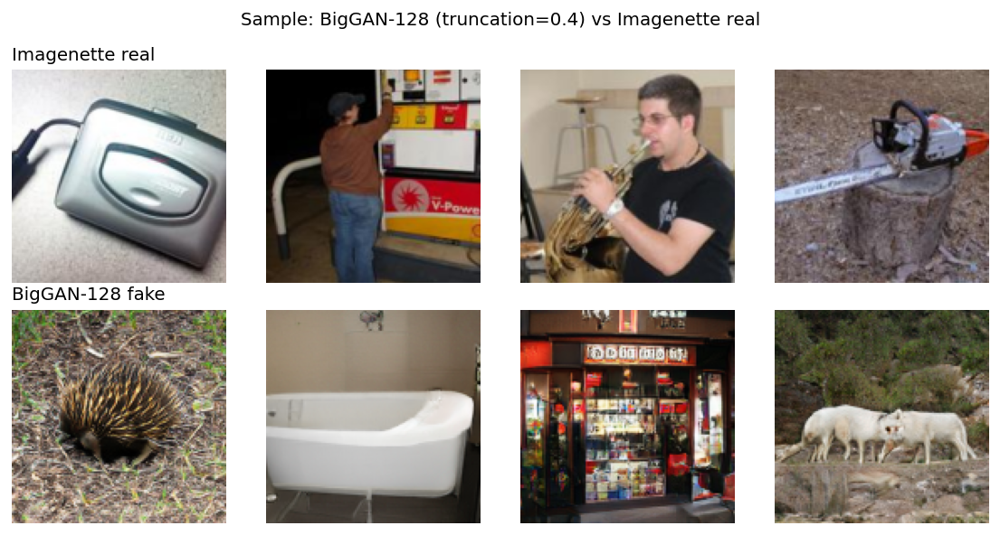

# Lab 02 — Phát hiện ảnh GAN giả mạo bằng CNN và Grad-CAM

**Môn**: Toán cho Trí tuệ nhân tạo  
**HV**: Nguyễn Minh Nhựt — MSHV 25C15019  
**Repo**: <https://github.com/nmnhut-it/math-for-ai> (folder `lab2_cnn/`)

---

## 1. Đề bài và hướng tiếp cận

Đề bài yêu cầu thử nghiệm 1 mô hình Gen-AI, phân tích kết quả và đề xuất phòng chống fake. Tôi chọn GAN (không phải Diffusion) và xây dựng 3 thí nghiệm song song trên 3 GAN khác nhau về kiến trúc:

- **cGAN-MLP** (Mirza & Osindero 2014, MLP thuần) — kiến trúc cũ nhất, đã train sẵn ở Lab 2 phần FFT (`lab2/output/cG_final.pth`).
- **PGAN-DTD** (Karras et al. 2018, conv unconditional, pretrained FAIR `pytorch_GAN_zoo`).
- **BigGAN-128** (Brock et al. 2018, conv class-conditional 1000 lớp ImageNet, pretrained DeepMind `pytorch-pretrained-biggan`).

Cùng 3 GAN đó, dùng 2 cấp detector: small CNN train từ đầu (~100 k–600 k tham số) và ResNet18 pretrained ImageNet với transfer learning (~11 M tham số). Thay vì hỏi "GAN nào khó detect", tôi hỏi "kiến trúc detector đến đâu thì bắt được GAN nào". Câu trả lời quyết định luôn đề xuất phòng chống ở mục 7.

Tất cả thí nghiệm chạy trên Colab GPU L4. Notebook `colab_pgan.ipynb` có pipeline 1-cú-click reproducible.

## 2. Thí nghiệm 1: cGAN-MNIST + TinyCNN

### 2.1 Quan sát ban đầu

Sample ảnh fake từ cGAN-MNIST so với MNIST gốc: số nhìn ra đúng nhưng nền đen có **noise rải rác**, bên trong nét chữ cũng lốm đốm. Lý do nằm ở generator: cGAN dùng chuỗi `Linear(100→256→512→1024→784)` rồi reshape, không có convolution. Mỗi pixel output là tích vô hướng độc lập với mỗi hàng trọng số → 2 pixel kề nhau không bị ràng buộc smoothness → output có **jitter pixel-to-pixel**.

→ Giả thuyết: tín hiệu jitter này đủ mạnh để 1 CNN nhỏ phân được thật/giả.

### 2.2 TinyCNN

Dataset: 10000 ảnh MNIST real + 10000 ảnh cGAN fake (sample với label ngẫu nhiên), gán nhãn `0=real, 1=fake`, split 80/20.

```
Input (1, 28, 28)
  Conv2d(1→16, 3×3) + ReLU + MaxPool(2)   → (16, 14, 14)
  Conv2d(16→32, 3×3) + ReLU + MaxPool(2)  → (32, 7, 7)
  Flatten → Linear(1568 → 64) + ReLU
  Linear(64 → 2)                          → logits
```

Tổng 105 346 tham số. Loss = cross-entropy, Adam `lr=1e-3`, batch 64, 5 epoch.

Kết quả val 4000 ảnh:

| Epoch | Train acc | Val acc |
|---|---|---|
| 1 | 81.91% | 96.57% |
| 5 (best) | 98.70% | **98.00%** |

Confusion matrix:

|  | pred = real | pred = fake |
|---|---|---|
| **true = real** | 1919 | 76 |
| **true = fake** | 4 | 2001 |

Real recall 96.19%, fake recall 99.80%.

### 2.3 Grad-CAM — CNN nhìn vào đâu?

Lý thuyết Grad-CAM (Selvaraju et al. 2017): với target conv layer $A^k$ (kênh $k$, shape $H{\times}W$), tính gradient của score lớp `fake` $y^c$ theo từng activation, lấy global average pool gọi là $\alpha_k$, rồi tổng hợp tuyến tính qua kênh:

$$
\alpha_k = \frac{1}{HW}\sum_{i,j} \frac{\partial y^c}{\partial A^k_{i,j}}, \quad
L^c = \mathrm{ReLU}\!\left(\sum_k \alpha_k A^k\right)
$$

Upsample $L^c$ từ `7×7` về `28×28`, normalize `[0,1]`, overlay màu jet lên ảnh gốc. Toán đằng sau chỉ là gradient + trung bình + nhân + ReLU — cùng họ với Sobel/Laplacian thủ công, nhưng kernel được học bằng gradient descent thay vì đặt sẵn.

Áp dụng lên 4 ảnh real + 4 ảnh fake từ val set. Để định lượng giả thuyết "CNN nhìn vào jitter", tôi đo thêm:

1. **Lệch khỏi −1 ở vùng nền tuyệt đối**: với mỗi ảnh, lấy mask các pixel mà max của 3×3 lân cận đều `< −0.85` (không gần nét chữ), tính trung bình `|x − (−1)|` trong mask đó. Tỉ lệ fake/real cho biết "fake ồn hơn real bao nhiêu lần".
2. **Pearson(high-freq, Grad-CAM)** per pixel: chứng minh Grad-CAM map tỉ lệ thuận với `|I − blur(I)|`.

Kết quả trên 200 ảnh mỗi lớp:

| | Real | Fake | Tỉ lệ |
|---|---|---|---|
| Lệch khỏi −1 ở nền | 0.00000 | 0.00154 | **fake gấp ~1712×** |

Pearson(high-freq, Grad-CAM) = +0.24 (vừa, dương rõ).


Đọc hình theo hàng:

- Hàng 2/5 (high-freq `|I − blur(I)|`): real chỉ nóng đỏ ở mép nét chữ; fake nóng cả mép, cả thân chữ, cả nền — chấm đỏ rải rác trong vùng đen.
- Hàng 3/6 (Grad-CAM overlay): vùng đỏ trên fake trùng với vùng có nhiều high-freq ở hàng 5. CNN bám đúng vào jitter pixel-level.
- Trên real, heatmap nóng đều ở thân chữ nhưng đa số đỏ nhạt hơn fake — confidence `P(fake)` cho real chỉ 0.01–0.05, cho fake 1.00.

Real MNIST có nền chính xác là `−1` (pixel `0` trước normalize). Fake cGAN không thể đạt đúng `−1` vì đầu ra MLP là tích trọng số liên tục — mỗi pixel "tự do" lệch một chút khỏi `−1`. Tỉ lệ 1712× là dấu vân tay không che giấu được của MLP architecture.

## 3. Thí nghiệm 2: PGAN-DTD + TexCNN scratch (baseline)

Thử lại phương pháp trên với một GAN sạch hơn — Progressive GAN. Khác cGAN-MLP ở chỗ:

- Generator dạng convolutional, thiết kế progressive (train 4×4 trước → 8×8 → ... → 1024×1024).
- Upsampling dùng **nearest-neighbor + Conv2d**, cố tình tránh `ConvTranspose2d` để khỏi để lại checkerboard artifact.
- Equalized learning rate, pixel-wise feature normalization.

Bản tôi dùng là pretrained trên DTD (Describable Textures Dataset, 5640 ảnh texture, 47 lớp). Latent `z ∈ ℝ⁵¹²`, output `3×128×128 RGB ∈ [−1, 1]`. Sample 1500 fakes, lấy 1500 reals từ DTD (resize-crop 128).

TexCNN (4 conv block + FC, 585 k tham số):

```
Conv(3→16,3×3)+pool → Conv(16→32,3×3)+pool → Conv(32→64,3×3)+pool → Conv(64→64,3×3)+pool
Flatten → Linear(4096→128) + Dropout(0.3) → Linear(128→2)
```

Adam `lr=5e-4`, batch 32, 8 epoch. Val 600 ảnh.

| Epoch | Train acc | Val acc |
|---|---|---|
| 1 | 56.04% | 54.33% |
| 8 (best) | 65.58% | **61.67%** |

Confusion matrix:

|  | pred = real | pred = fake |
|---|---|---|
| **true = real** | 200 | 105 |
| **true = fake** | 125 | 170 |

Chỉ hơn random guess 50% chừng 12 điểm. Real recall 65.57%, fake recall 57.63% — gần một nửa fake lọt qua. Hand-feature `Var(Laplacian)` cũng đã thử: Cohen's d = −0.19 trên cùng cặp PGAN/DTD, nghĩa là không tách được chiều nào.

Kết luận sơ bộ: PGAN không có jitter pixel-level như cGAN-MLP, TexCNN scratch không bám được. Nhưng kết luận này còn 1 confound — "PGAN khó" hay "TexCNN yếu"? Phải tách bằng thí nghiệm 3.

## 4. Thí nghiệm 3a: PGAN-DTD + ResNet18 transfer (tách confound)

Cùng dataset PGAN-DTD nhưng đổi detector sang ResNet18 pretrained ImageNet. Số ảnh tăng lên 2500/lớp để khớp với thí nghiệm BigGAN ở mục 5.

Transfer learning 2 phase:

- **Phase 1**: freeze toàn bộ backbone (`conv1` ... `layer3`), chỉ thay `fc(512→1000)` thành `fc(512→2)` và train lớp này. Trainable 1 026 tham số. 3 epoch, Adam `lr=1e-3`.
- **Phase 2**: unfreeze `layer4` + `fc`, fine-tune. Trainable 8 394 754 tham số. 12 epoch, Adam `lr=1e-4`.

Renormalize: input đang ở `[−1, 1]` (Normalize 0.5/0.5), nhưng ResNet18 pretrained kỳ vọng ImageNet stats `mean=[0.485,0.456,0.406], std=[0.229,0.224,0.225]`. Convert trước mỗi forward. Augment chỉ horizontal flip 0.5.

Kết quả:

| | Phase 1 (frozen) | Phase 2 (unfreeze layer4) |
|---|---|---|
| Best val acc | **88.70%** | **98.70%** |

Confusion matrix (best, 1000 ảnh val):

|  | pred = real | pred = fake |
|---|---|---|
| **true = real** | 471 | 10 |
| **true = fake** | 3 | 516 |

Real recall 97.92%, fake recall 99.42%.

**Quan sát quan trọng**: Phase 1 alone — chỉ 1 lớp Linear(512→2) train trên feature ImageNet đã đông cứng — đạt 88.70% trên PGAN. Tức là feature ImageNet đã học sẵn (qua việc phân loại 1000 lớp ảnh tự nhiên) đủ để tách thật/giả bằng 1 hyperplane. ResNet18 không cần "biết về GAN" — nó chỉ biết "ảnh tự nhiên trông như thế nào", và PGAN samples đủ lệch khỏi cái đó.

Phase 2 chỉ thêm ~10 điểm tinh chỉnh.

## 5. Thí nghiệm 3b: BigGAN-128 + Imagenette + ResNet18 transfer

Để có "good conditional GAN" thực thụ — thử BigGAN-128, 2018 SOTA, class-conditional 1000 lớp ImageNet với spectral normalization.

Sample 2500 fakes (class-id ngẫu nhiên `[0, 1000)`, truncation 0.4) dùng `pytorch-pretrained-biggan`:

```python
from pytorch_pretrained_biggan import BigGAN, one_hot_from_int, truncated_noise_sample
bg = BigGAN.from_pretrained('biggan-deep-128')
noise = truncated_noise_sample(truncation=0.4, batch_size=B)
class_vec = one_hot_from_int(np.random.randint(0,1000,B), batch_size=B)
output = bg(torch.from_numpy(noise), torch.from_numpy(class_vec), 0.4)  # (B,3,128,128)
```

Reals: 2500 ảnh từ Imagenette-160 (10 lớp ImageNet subset, public download, không cần auth).



Cùng pipeline ResNet18 transfer như mục 4:

| | Phase 1 (frozen) | Phase 2 (unfreeze layer4) |
|---|---|---|
| Best val acc | **90.30%** | **99.10%** |

Confusion matrix:

|  | pred = real | pred = fake |
|---|---|---|
| **true = real** | 474 | 7 |
| **true = fake** | 2 | 517 |

Real recall 98.54%, fake recall 99.61%.

Phase 1 frozen-features achieves 90.30% — tương tự PGAN ở Phase 1. Cùng cơ chế: ImageNet features đã encode "natural-image manifold", BigGAN samples lệch khỏi đó.

## 6. Tổng hợp + tách confound

| Detector | Tham số | cGAN-MNIST | PGAN-DTD | BigGAN-128 |
|---|---|---|---|---|
| Hand-feature `Var(Lap)` | 0 | d = +1.08 (mạnh) | d = −0.19 (~0) | chưa đo |
| Small CNN scratch | 105 k–585 k | **98.00%** (TinyCNN) | **61.67%** (TexCNN) | n/a |
| ResNet18 transfer | 11.2 M | n/a | **98.70%** | **99.10%** |

ResNet18 transfer đẩy PGAN từ 61.67% lên 98.70% (cùng dataset, cùng N=2500). Áp dụng trên BigGAN cho 99.10% — chỉ chênh 0.4 điểm. Hai số gần như bằng nhau.

→ Cái bị "kẹt 61.67%" ở mục 3 không phải PGAN khó, mà là TexCNN scratch không đủ. Yếu tố **detector capacity + ImageNet pretraining** mới dominate, kiến trúc GAN chỉ là yếu tố phụ một khi detector đủ mạnh.

Đây là một negative result có giá trị — nếu chỉ chạy mục 3 mà không có 4, lab sẽ kết luận sai về tính chất của PGAN. Việc chạy ô bị thiếu (PGAN × ResNet18) tránh được sai lệch đó.

## 7. Đề xuất phòng chống fake data

Nhìn từ 3 thí nghiệm, có vài hướng cụ thể:

1. **Phân tầng detector theo cost**: dùng detector rẻ trước (`Var(Lap)` hoặc small CNN), nếu confidence thấp escalate lên ResNet18 transfer. Pipeline kiểu cascade này tận dụng được fact rằng nhiều GAN đời cũ vẫn dễ bắt bằng method rẻ — không cần 11M tham số cho mọi ảnh.
2. **Provenance thay vì content-based detection**: tất cả method ở trên đều có thể bị adversarial attack (attacker biết detector → train GAN với loss thêm penalty trên feature ResNet18 hoặc trên `Var(Lap)`). Hướng bền vững là watermark từ máy ảnh (chuẩn C2PA) hoặc digital signature — chứng minh ảnh là thật, không cần chứng minh ảnh là giả.
3. **Continuous retraining**: GAN tiến hóa nhanh (cGAN 2014 → PGAN 2018 → BigGAN 2018 → StyleGAN3 2021 → diffusion 2022+). Detector phải retrain định kỳ trên fake mới.

## 8. Kết luận

Train được TinyCNN 105 k tham số phân biệt cGAN-MNIST fake vs MNIST real ở 98.00%. Grad-CAM xác nhận CNN tự học "nhìn vào jitter pixel-level" — vùng nền của fake lệch khỏi `−1` mạnh hơn real ~1712 lần, là dấu vân tay không che được của MLP architecture.

Trên modern GAN (PGAN, BigGAN), small CNN scratch không đủ (61.67% trên PGAN-TexCNN). Nhưng ResNet18 pretrained ImageNet với transfer learning đẩy cả PGAN và BigGAN lên ~98.7–99.1% — chứng tỏ feature ImageNet đã encode sẵn "natural-image manifold", và GAN samples lệch khỏi đó đủ để 1 hyperplane tách được (Phase 1 frozen-features đạt 88–90% mà không train backbone).

Yếu tố quyết định không phải GAN architecture, mà là detector capacity + transfer learning. Hướng phòng chống bền vững là provenance-based (watermark, signature), vì content-based detection đều có thể bị adversarial attack đánh bại.
