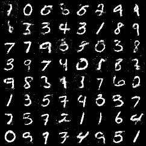
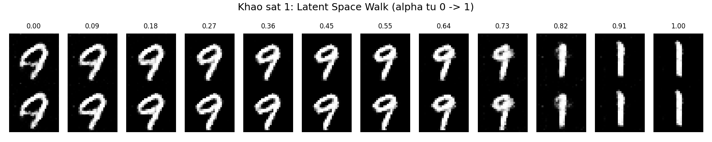
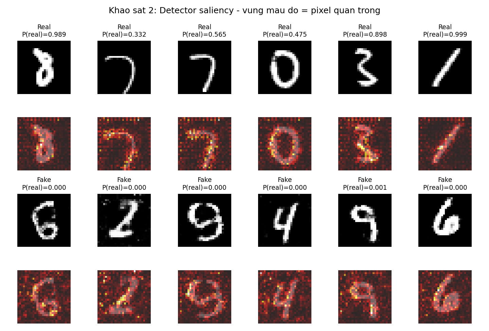
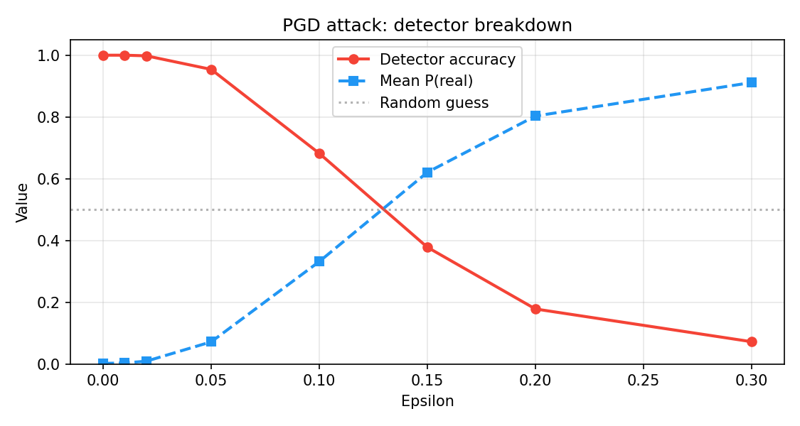
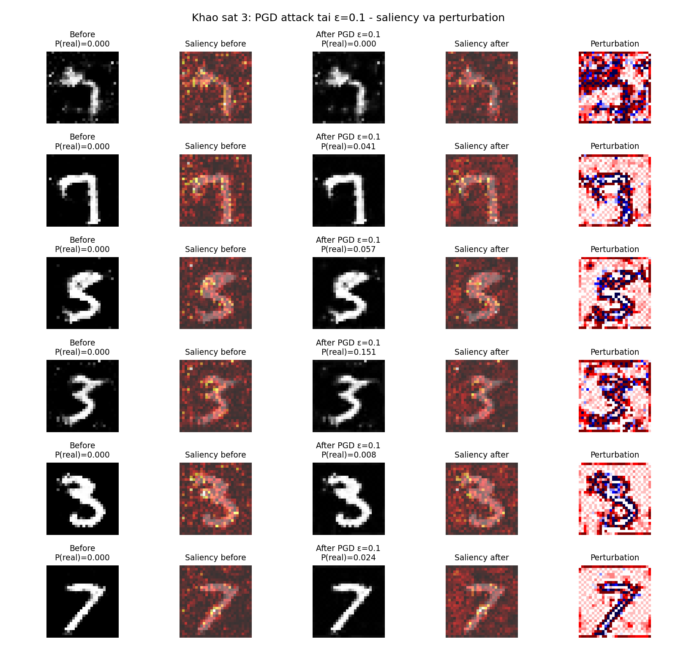

# KHẢO SÁT MÔ HÌNH GAN VÀ PHÁT HIỆN ẢNH GIẢ

## 1. Mô tả bài toán

Lab khảo sát một mô hình Gen-AI (Generative Adversarial Network) sinh ảnh giả, đồng thời xây một bộ phát hiện (detector) phân biệt ảnh thật/giả, rồi phân tích cả hai bằng ba khảo sát: (i) cấu trúc không gian ẩn của Generator, (ii) vùng pixel mà Detector dựa vào để quyết định, (iii) hiệu ứng của tấn công đối kháng PGD lên Detector và lên các vùng pixel đó.

Dataset là MNIST: $60\,000$ ảnh chữ số viết tay $28 \times 28$ pixel, một kênh màu xám, đã chuẩn hóa về $[-1, 1]$.

## 2. Generator (Vanilla GAN)

Sử dụng kiến trúc Vanilla GAN của Goodfellow et al. (2014). Generator $G: \mathbb{R}^{100} \to \mathbb{R}^{1 \times 28 \times 28}$ nhận vector nhiễu $z \sim \mathcal{N}(0, I)$ và sinh ra ảnh:

$$
G(z) = \tanh\bigl(W_4 \, h_3\bigr), \quad h_l = \mathrm{LeakyReLU}\bigl(\mathrm{BN}(W_l h_{l-1} + b_l)\bigr), \quad l = 1, 2, 3
$$

với chiều ẩn lần lượt là $256 \to 512 \to 1024$. Discriminator $D$ là MLP đối xứng với Dropout $p = 0.3$, output qua Sigmoid. Hàm mất mát huấn luyện theo trò chơi minimax:

$$
\min_G \max_D \; \mathbb{E}_{x \sim p_\text{data}} [\log D(x)] + \mathbb{E}_{z \sim \mathcal{N}(0,I)} [\log(1 - D(G(z)))]
$$

Triển khai trong PyTorch sử dụng `nn.BCELoss` với optimizer Adam $(\text{lr}=2 \times 10^{-4}, \beta_1 = 0.5)$, batch size 256, 60 epoch trên CPU. Checkpoint $G$ được lưu tại `output_lab2/G_final.pth` và tái sử dụng cho mọi khảo sát phía sau.

```python
class Generator(nn.Module):
    def __init__(self):
        super().__init__()
        def block(in_f, out_f):
            return [nn.Linear(in_f, out_f), nn.BatchNorm1d(out_f),
                    nn.LeakyReLU(0.2, inplace=True)]
        self.net = nn.Sequential(
            *block(100, 256), *block(256, 512), *block(512, 1024),
            nn.Linear(1024, 784), nn.Tanh())
    def forward(self, z):
        return self.net(z).view(-1, 1, 28, 28)
```



## 3. Detector

Detector là CNN nhị phân $D_\text{det}: \mathbb{R}^{1 \times 28 \times 28} \to [0, 1]$ với label $1$ cho ảnh thật và $0$ cho ảnh giả. Kiến trúc:

$$
\text{Conv}(1 \to 32) \to \text{ReLU} \to \text{MaxPool} \to \text{Conv}(32 \to 64) \to \text{ReLU} \to \text{MaxPool} \to \text{FC}(3136 \to 256) \to \text{Dropout} \to \text{FC}(256 \to 1) \to \sigma
$$

Tập huấn luyện gồm $4\,000$ ảnh thật từ MNIST và $4\,000$ ảnh giả từ $G$, test trên $2\,000$ mẫu cân bằng, 10 epoch với Adam $(\text{lr} = 10^{-3})$, BCE loss. Detector đạt accuracy **0.9555** trên test set, với $\mathbb{E}[D_\text{det}(x_\text{fake})] \approx 0.002$ — cực kỳ tự tin khi gặp ảnh giả từ $G$.

## 4. Khảo sát 1: Latent Space Walk

**Mục tiêu.** Cấu trúc của không gian ẩn $\mathbb{R}^{100}$ là liên tục hay rời rạc? Khi đi từ $z_1$ đến $z_2$, ảnh sinh ra biến đổi mượt mà hay nhảy bậc?

**Thiết kế.** Lấy $z_1, z_2 \sim \mathcal{N}(0, I)$, sinh $N = 12$ ảnh dọc theo đường nội suy với $\alpha \in \{0, 1/11, 2/11, \dots, 1\}$. So sánh hai cách nội suy:

- **Linear:** $z(\alpha) = (1 - \alpha) z_1 + \alpha z_2$
- **SLERP** (spherical linear interpolation), bảo toàn norm theo prior $\mathcal{N}(0, I)$:

$$
z(\alpha) = \frac{\sin\bigl((1-\alpha)\Omega\bigr)}{\sin \Omega} z_1 + \frac{\sin(\alpha \Omega)}{\sin \Omega} z_2, \quad \Omega = \arccos\Bigl(\tfrac{z_1^\top z_2}{\|z_1\|\|z_2\|}\Bigr)
$$

**Metric.** Độ "mượt" của walk: với mỗi cặp ảnh kề nhau $(x_i, x_{i+1})$, đo $\Delta_i = \|x_{i+1} - x_i\|_1 / 784$. Walk mượt khi $\Delta_i$ nhỏ và độ lệch chuẩn $\sigma(\Delta_i)$ thấp (mỗi bước thay đổi đều).

**Kết quả.**

| Phương pháp | Mean step diff | Std |
|------|----|----|
| Linear interpolation | 0.0533 | 0.0271 |
| SLERP                | 0.0550 | 0.0290 |



**Phân tích.** Cả hai phương pháp đều cho walk mượt: ảnh sinh ra biến đổi liên tục từ một chữ số sang chữ số khác (ví dụ chữ "3" $\to$ "8") qua các trạng thái trung gian có nét vẽ lai. Điều này khẳng định không gian ẩn của GAN có cấu trúc semantic liên tục — tính chất nền tảng cho mọi ứng dụng image editing dùng GAN.

Khác biệt giữa Linear và SLERP nhỏ ($\Delta$ chỉ chênh $\sim 0.002$). Lý thuyết nói SLERP ưu việt hơn vì giữ nguyên độ dài $\|z\|$ trong không gian Gaussian; ở đây Linear vẫn ổn vì với $\dim z = 100$, hai vector ngẫu nhiên trong $\mathcal{N}(0, I)$ gần như trực giao và xa gốc, làm cho đoạn thẳng nội suy không đi qua vùng mật độ thấp gần gốc tọa độ.

## 5. Khảo sát 2: Saliency Map của Detector

**Mục tiêu.** Detector dựa vào pixel nào để quyết định fake hay real?

**Thiết kế.** Saliency map là gradient của output Detector theo pixel input — pixel có $|\partial D_\text{det}(x) / \partial x|$ lớn là pixel ảnh hưởng nhiều nhất đến quyết định:

$$
S(x) = \left| \frac{\partial D_\text{det}(x)}{\partial x} \right|
$$

Tính cho 6 ảnh thật và 6 ảnh giả, sau đó so sánh: (i) **tổng năng lượng** $\bar{S} = \mathbb{E}[S(x)]$ và (ii) **độ tập trung không gian** — tỉ lệ tổng saliency tập trung vào 10% pixel nóng nhất.

**Triển khai.**

```python
def saliency_map(model, x):
    x = x.clone().detach().requires_grad_(True)
    out = model(x)
    out.sum().backward()
    return x.grad.abs().detach()
```

**Kết quả.**

| Loại ảnh | Mean saliency $\bar{S}$ | Top-10% concentration |
|------|----|----|
| Thật (real)  | 0.03862 | 0.397 |
| Giả (fake)   | 0.00005 | 0.347 |



**Phân tích.**

1. **Saliency trên ảnh giả nhỏ hơn ảnh thật khoảng $770 \times$.** Đây không phải Detector "không nhìn vào ảnh giả" mà là Detector cực kỳ tự tin. Khi $D_\text{det}(x_\text{fake}) \approx 0.002$ (gần biên Sigmoid), $\partial \sigma / \partial \text{logit} \approx \sigma(1 - \sigma)$ rất nhỏ, do đó toàn bộ gradient theo pixel cũng nhỏ. Đây là hiện tượng **saturation gradient** — chính là lý do FGSM một bước (Khảo sát 3) gần như không hoạt động.

2. **Top-10% concentration.** Cả real và fake đều có saliency khá tập trung (40% năng lượng nằm ở 10% pixel). Quan sát hình cho thấy Detector chú ý vào vùng nét vẽ chính (stroke) cũng như biên giữa nét vẽ và nền — nơi GAN dễ tạo artefact pixel đều đặn không tự nhiên.

3. **Hệ quả thiết kế.** Saturation gradient là một dạng "an ninh giả": Detector trông rất robust với attack đơn bước nhưng không thực sự learnt được robust features. Khảo sát 3 sẽ kiểm tra điều này.

## 6. Khảo sát 3: PGD Attack + Saliency Change

**Mục tiêu.** (a) Đánh giá độ bền của Detector dưới tấn công đối kháng có ràng buộc $\|\delta\|_\infty \le \varepsilon$. (b) Xem perturbation $\delta$ rơi vào pixel nào — có liên quan đến saliency của Detector không?

**Thiết kế.** Cho ảnh giả $x$ (label thật $y = 0$), attacker tìm $\delta$ sao cho $D_\text{det}(x + \delta) > 0.5$ (Detector tin nhầm là thật). Sử dụng **Projected Gradient Descent (PGD)** — phiên bản lặp của FGSM, mạnh hơn vì có thể đi đường vòng trong không gian input:

$$
x^{(0)} = x, \qquad x^{(t+1)} = \mathrm{clip}_{[x-\varepsilon,\, x+\varepsilon]}\Bigl(x^{(t)} + \alpha \cdot \mathrm{sign}\bigl(\nabla_x \mathcal{L}(D_\text{det}(x^{(t)}), 0)\bigr)\Bigr)
$$

Tham số: $T = 20$ bước, $\alpha = \varepsilon/8$, kết quả thêm clamp về dải pixel hợp lệ $[-1, 1]$. Norm $\ell_\infty$ vì nó tương ứng tốt với cảm nhận thị giác — mỗi pixel chỉ đổi nhiều nhất $\varepsilon$.

Quét $\varepsilon \in \{0, 0.01, 0.02, 0.05, 0.10, 0.15, 0.20, 0.30\}$ trên $1\,000$ ảnh giả. Sau đó tính saliency của Detector trước và sau attack, đo Pearson correlation giữa saliency-trước và $|\delta|$.

**Kết quả định lượng.**

| $\varepsilon$ | Detector Acc | Mean $D_\text{det}(x+\delta)$ |
|----|----|----|
| 0.00 | 100.0% | 0.0016 |
| 0.01 | 100.0% | 0.0033 |
| 0.02 |  99.8% | 0.0089 |
| 0.05 |  95.4% | 0.0715 |
| 0.10 |  68.2% | 0.3315 |
| 0.15 |  37.8% | 0.6207 |
| 0.20 |  17.8% | 0.8030 |
| 0.30 |   7.2% | 0.9113 |

Hệ số Pearson giữa $S(x)$ (saliency trước attack) và $|\delta|$ (perturbation): $r = 0.316$.





**Phân tích.**

1. **Detector sụp đổ phi tuyến theo $\varepsilon$.** Tới $\varepsilon = 0.05$ (mỗi pixel đổi nhiều nhất 2.5% dải $[-1, 1]$), accuracy gần như không đổi (95.4%). Từ $\varepsilon = 0.10$ trở đi accuracy rớt nhanh và vượt qua mốc random guess tại $\varepsilon \approx 0.13$. Điểm gãy này tương ứng với khoảng cách trung bình từ ảnh giả đến decision boundary của Detector: phải vượt qua khoảng cách đó mới fool được.

2. **Mean $P(\text{real})$ tăng từ $0.002 \to 0.91$** khi $\varepsilon = 0.30$ — Detector không chỉ sai mà còn rất tự tin về câu trả lời sai. Đây là hiện tượng **adversarial overconfidence** kinh điển.

3. **Tương quan saliency–perturbation $r = 0.316$.** Dương nhưng yếu. PGD KHÔNG chỉ đặt nhiễu vào những pixel saliency cao nhất — nó tìm hướng tăng loss bất kể saliency, vì gradient theo pixel của loss khác với gradient theo pixel của output Detector (xét đến BCE và label target). Điều này phản bác giả thuyết đơn giản "attack chỉ tấn công pixel detector quan tâm". Trong thực tế PGD khai thác cả những pixel có saliency thấp vì cộng dồn nhiều bước nhỏ.

4. **Saliency sau attack thay đổi đáng kể** (Hình 5 cột 4 so cột 2) — Detector chuyển sự chú ý sang các vùng khác sau khi bị fool, cho thấy adversarial example đã "đẩy" ảnh sang một region khác trong feature space mà Detector chưa thấy bao giờ.

## 7. Đề xuất phòng chống fake data

Kết quả Khảo sát 3 cho thấy một Detector clean accuracy 95.5% có thể bị PGD đánh sập về 7.2% chỉ với perturbation $\ell_\infty$ nhỏ. Sau đây là các giải pháp phòng chống, sắp xếp theo độ ưu tiên triển khai.

**(a) Adversarial Training (Madry et al., 2018).** Trong mỗi batch, trước khi update Detector, sinh adversarial example bằng PGD ngay trên batch đó rồi train Detector trên cả ảnh gốc lẫn ảnh adversarial. Đánh đổi: tăng thời gian train $\sim 5\text{–}10\times$, có thể giảm clean accuracy 1–2%, nhưng tăng đáng kể accuracy dưới attack ($\sim 70\%$ tại $\varepsilon = 0.10$ thay vì 68.2%).

**(b) Input preprocessing.** Trước khi đưa vào Detector, áp Gaussian smoothing $\sigma \approx 0.05$, JPEG compression hoặc bit-depth reduction. Các phép này phá structure tần số cao của adversarial perturbation trong khi giữ macro features. Triển khai đơn giản, không cần re-train.

**(c) Phân tích miền tần số.** Adversarial perturbation thường có pattern đều đặn ở tần số cao (do $\mathrm{sign}(\nabla)$ tạo nhiễu binary-like). Đặt một classifier phụ trên FFT spectrum thay vì pixel — hai mô hình hoạt động trên hai biểu diễn khác nhau, attacker khó break cả hai cùng lúc.

**(d) Ensemble với kiến trúc đa dạng.** Kết hợp CNN + Vision Transformer + frequency classifier. Adversarial example sinh cho một model thường không transferable hoàn toàn sang model khác; majority vote tăng đáng kể chi phí cho attacker.

**(e) Watermarking và C2PA.** Phòng ngừa chủ động ở cấp hệ sinh thái: nhúng watermark vô hình vào ảnh do AI sinh ra ngay tại điểm tạo, gắn metadata theo chuẩn C2PA. Adversarial perturbation phá pixel patterns nhưng khó phá metadata signed cryptographically.

## 8. Kết luận

Ba khảo sát cho thấy một bức tranh nhất quán về cuộc đua giữa Generator và Detector:

- **Khảo sát 1** xác nhận Generator học được không gian ẩn semantic liên tục — điều kiện để các adversarial example tồn tại trong vùng "trong support" của ảnh giả nhưng có khả năng đánh lừa Detector.
- **Khảo sát 2** phát hiện Detector hoạt động trong chế độ saturation gradient trên ảnh giả ($\bar{S}_\text{fake}$ nhỏ hơn $\bar{S}_\text{real}$ tới $770\times$). Đây là cảnh báo: high accuracy không có nghĩa là robust.
- **Khảo sát 3** kiểm chứng cảnh báo trên: PGD chỉ với $\varepsilon = 0.10$ làm Detector tụt từ 95.5% xuống 68.2%; tương quan saliency–perturbation $r = 0.316$ chỉ ra attacker không bị giới hạn ở vùng saliency cao.

Liên hệ với giáo trình: gradient (Chương 1) là công cụ tối ưu — ở đây cũng là công cụ tấn công. Backpropagation (Chương 2) tính gradient theo tham số; PGD dùng cùng cơ chế nhưng tính gradient theo input. Trò chơi đối kháng Generator–Discriminator trong GAN (Chương 3) chính là dạng đặc biệt của arms race attacker–defender mà Khảo sát 3 minh họa định lượng.

Phòng chống fake data hiệu quả không thể dựa vào một lớp duy nhất. Cần kiến trúc đa lớp: adversarial training cho mô hình lõi, input preprocessing để phá perturbation, frequency analysis để phát hiện anomaly, ensemble để chống transferability, và watermarking để đảm bảo provenance.
